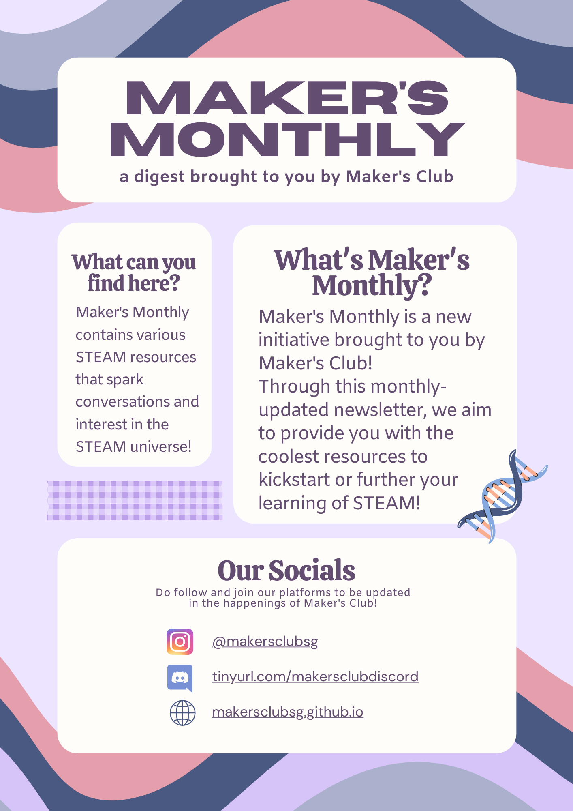
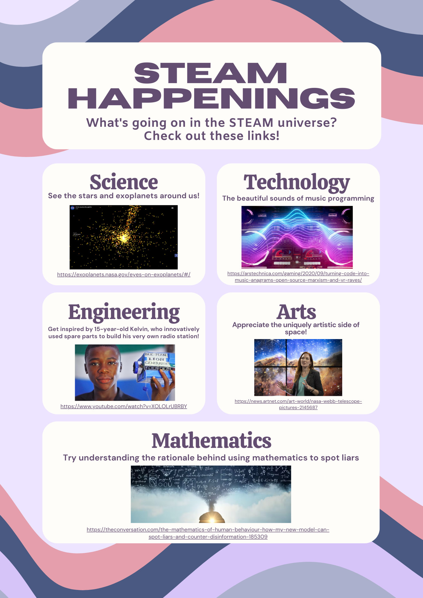

^title Maker's Monthly: August
^tags Maker's Monthly

## Links
[Science: See the stars and exoplanets around us!](https://exoplanets.nasa.gov/eyes-on-exoplanets/#/)
[Technology: The beautiful sounds of music programming](https://arstechnica.com/gaming/2020/09/turning-code-into-music-anagrams-open-source-marxism-and-vr-raves/)
[Engineering: Get inspired by 15-year-old Kelvin, who innovatively used spare parts to build his very own radio station!](https://www.youtube.com/watch?v=XOLOLrUBRBY)
[Arts: Appreciate the once in a lifetime artistic side of space!](https://news.artnet.com/art-world/nasa-webb-telescope-pictures-2145687)
[Mathematics: Try understanding the rationale behind using mathematics to spot liars](https://theconversation.com/the-mathematics-of-human-behaviour-how-my-new-model-can-spot-liars-and-counter-disinformation-185309)

## Extra Resources
For more resources, check out our [extra resources for August.](../article/extra resources: august.html)
