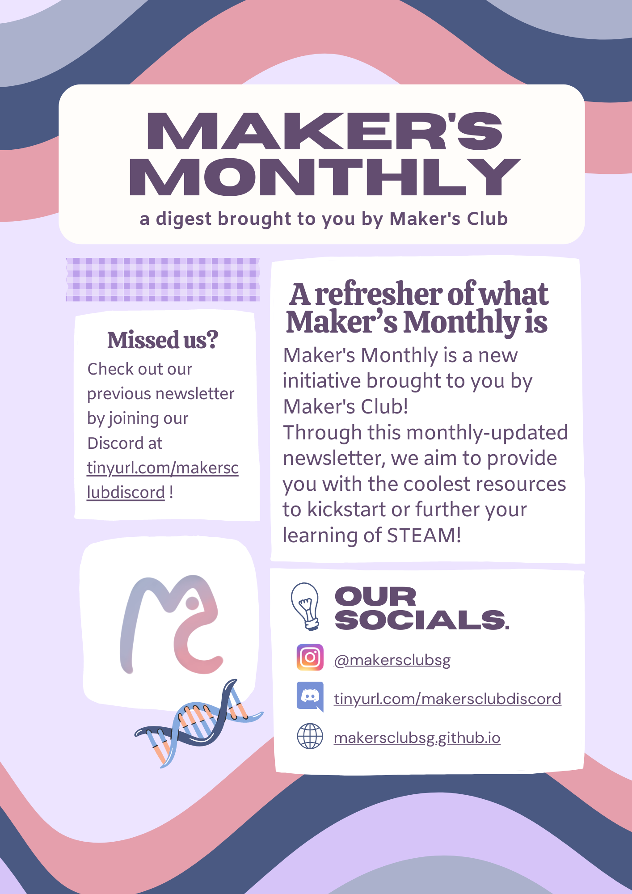
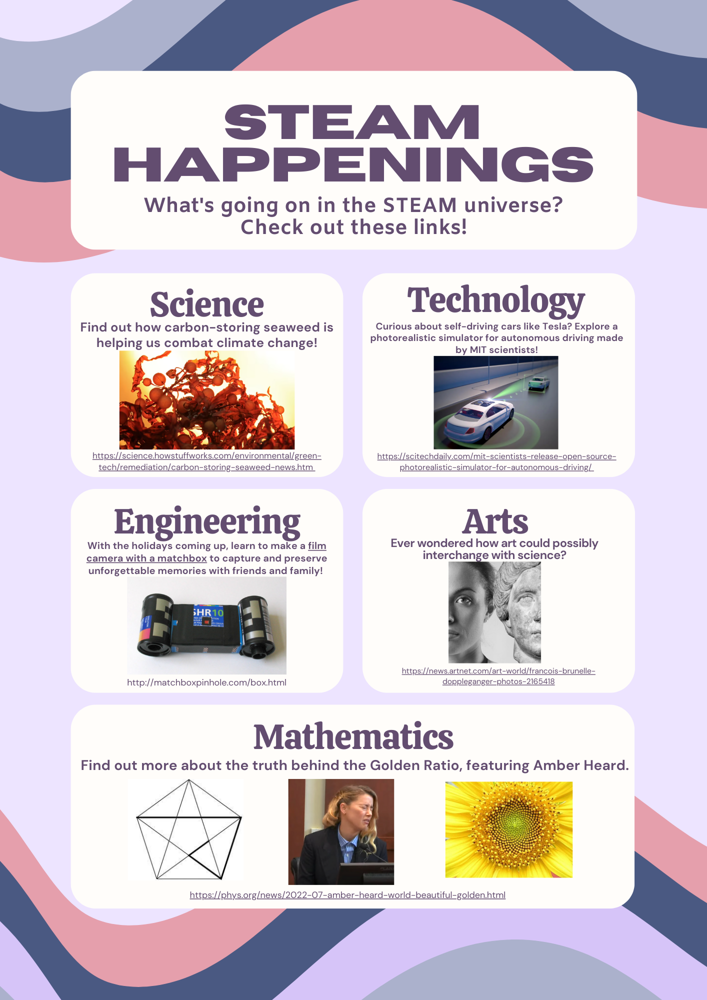
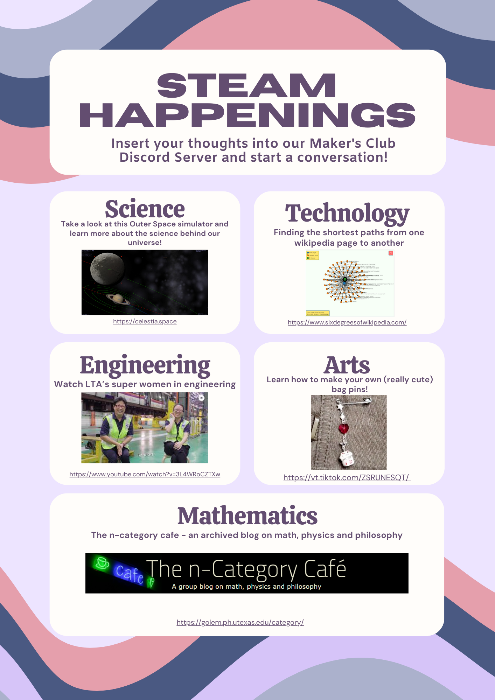
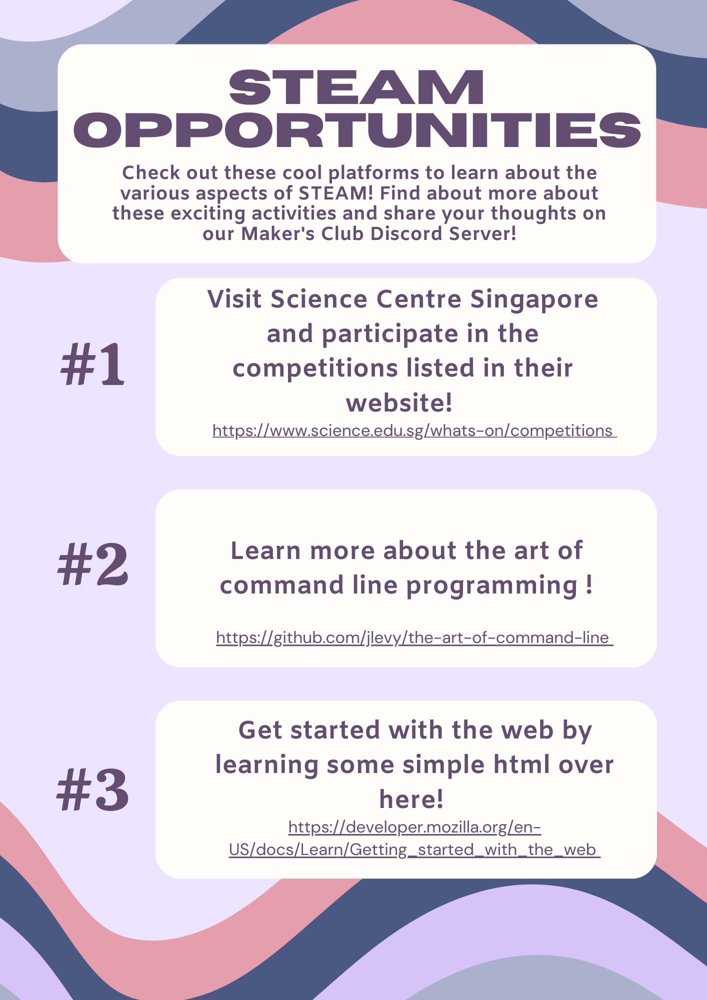
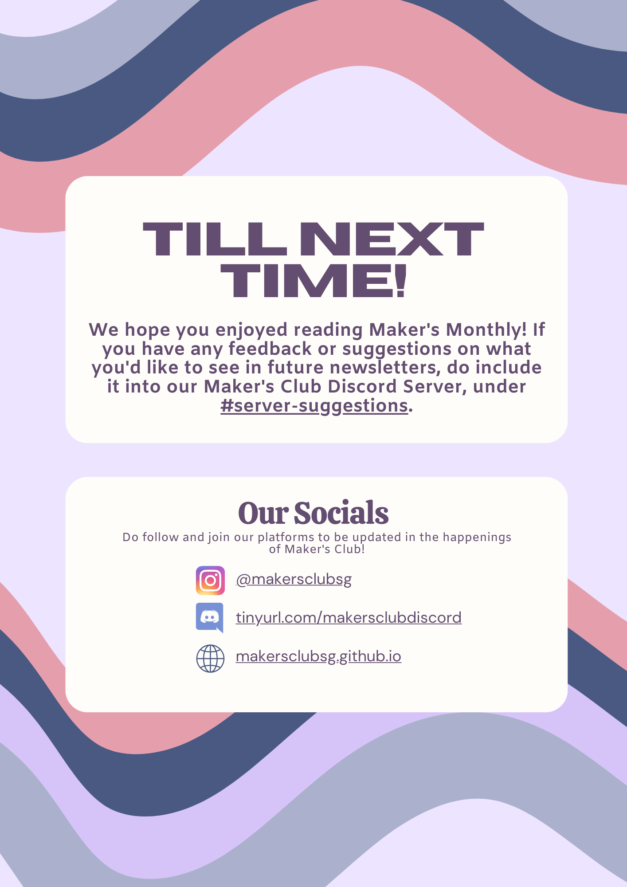

^title Maker's Monthly: September
^tags Maker's Monthly

## Links
[Science: Find out how carbon-storing seaweed is helping us combat climate change!](https://science.howstuffworks.com/environmental/green-tech/remediation/carbon-storing-seaweed-news.htm )
[Science: Take a look at this Outer Space simulator and learn more about the science behind our universe!](https://celestia.space)
[Technology: Curious about self-driving cars like Tesla?](https://scitechdaily.com/mit-scientists-release-open-source-photorealistic-simulator-for-autonomous-driving/)
[Technology: Finding the shortest paths from one wikipedia page to another!](https://www.sixdegreesofwikipedia.com/)
[Engineering: With the holidays coming up, learn to make a film camera with a matchbox to capture and preserve unforgettable memories with friends and family!](http://matchboxpinhole.com/box.html)
[Engineering: LTA’s super women in engineering!](https://www.youtube.com/watch?v=3L4WRoCZTXw)
[Arts: Ever wondered how art could possibly interchange with science?](https://news.artnet.com/art-world/francois-brunelle-doppleganger-photos-2165418)
[Arts: Learn how to make your own (really cute) bag pins!](https://vt.tiktok.com/ZSRUNESQT/)
[Mathematics: Find out more about the truth behind the Golden Ratio, featuring Amber Heard.](https://phys.org/news/2022-07-amber-heard-world-beautiful-golden.html)
[Mathematics: The n-category cafe - an archived blog on math, physics and philosophy.](https://golem.ph.utexas.edu/category/)

## Extra Resources
For more resources, check out our [extra resources for September.](../article/extra resources: september.html)
